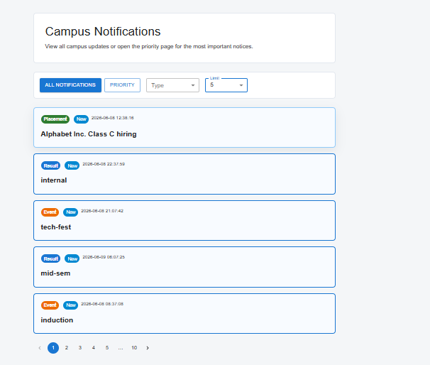
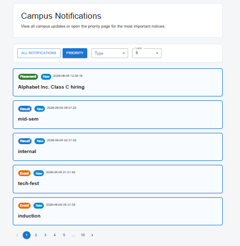
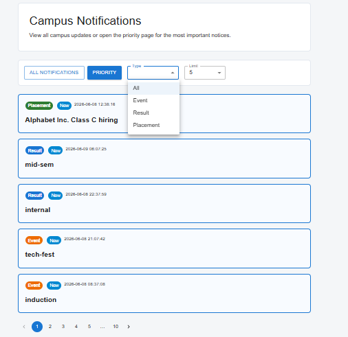

# Stage 1 - Priority Inbox Design

## Objective

Implement a Priority Inbox that displays the top N most important unread notifications for students.

## Priority Rules

Notifications are prioritized using the following weights:

| Type      | Weight |
| --------- | ------ |
| Placement | 3      |
| Result    | 2      |
| Event     | 1      |

If two notifications have the same priority, the more recent notification is displayed first.

## Approach

1. Fetch notifications from the provided Notifications API.
2. Assign a priority weight based on notification type.
3. Sort notifications by:

   * Priority Weight (Descending)
   * Timestamp (Descending)
4. Display the top N notifications selected by the user.

## Algorithm

```javascript
Placement > Result > Event

Sort by:
1. Weight Descending
2. Timestamp Descending

Return first N notifications
```

## Time Complexity

Sorting: O(n log n)

Selecting top N: O(n)

Overall: O(n log n)

## Logging Integration

The logging middleware is used throughout the application.

Logs are generated for:

* Application startup
* Notification fetch requests
* Successful API responses
* Failed API responses
* Priority calculation
* Filter changes
* Pagination changes
* Notification viewed events

## User Interface

Features implemented:

* Notifications List
* Priority Inbox
* Type Filtering
* Pagination
* Read/Unread Tracking
* Error Handling
* Responsive Design using Material UI

## Assumptions

* Notifications are fetched from the provided API.
* No notification data is stored in a database.
* No notifications are hard-coded.
* Authentication token is generated using the provided Auth API.

## Future Improvements

* Real-time notifications using WebSockets
* Infinite scrolling
* Push notifications
* User-specific priority preferences




